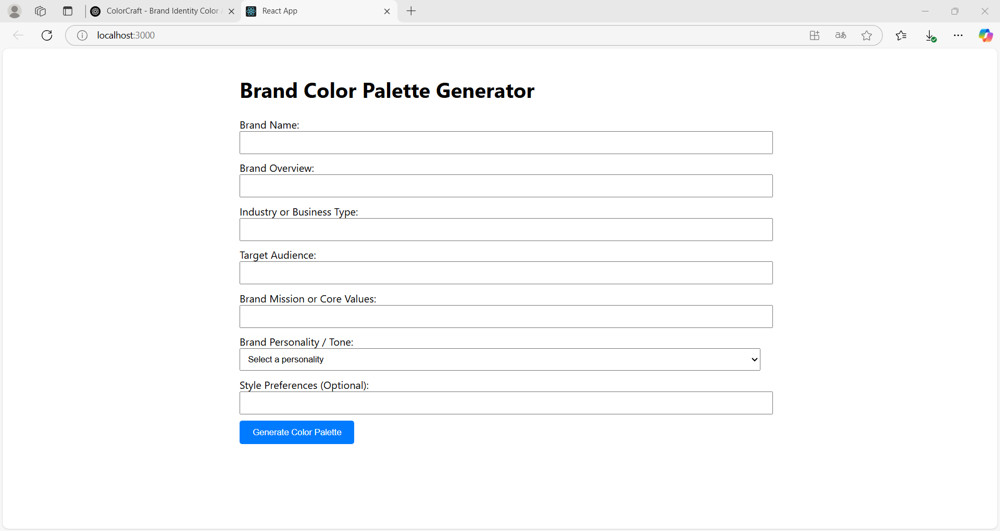

# 🎨 ColorCraft

**ColorCraft** is a web-based tool that helps you instantly generate beautiful, brand-aligned color palettes using AI. It's designed for entrepreneurs, designers, and marketers who want fast, creative, and cohesive color suggestions for their brand identity.

---

## 📂 Folder Structure

```
colorcraft/
│
├── backend/              # Express.js backend API
│   ├── server.js         # Main server file
│   ├── package.json      # Backend dependencies
│   └── .env.example
│
├── frontend/             # React frontend (Vite)
│   ├── public/           # Static assets
│   ├── src/              # React app source code
│   ├── package.json      # Frontend dependencies
│   └── .gitignore
│
├── docs/                 # Additional project documentation (optional)
│
├── colorcraft_logo.png   # Brand logo
└── README.md             # You are here!
```

---

## 🚀 Getting Started

### 1. Clone the repository

```bash
git clone https://github.com/tesserchoi/colorcraft_v0.1.0.git
cd colorcraft
```

### 2. Install dependencies

#### Frontend

```bash
cd frontend
npm install
```

#### Backend

```bash
cd ../backend
npm install
```

---

## 🛠 Environment Variables

🔑 Rename `.env.example` to `.env` and paste in your OpenAI API key to get started.

```
OPENAI_API_KEY=your-api-key-here
```

---

## ▶️ Running the App

### 1. Start the backend server

```bash
cd backend
node server.js
```

It will run at: `http://localhost:5000`

### 2. Start the frontend

Open a new terminal and run:

```bash
cd frontend
npm run dev
```

It will open the app in your browser at: `http://localhost:5173`

---

## 🧠 Built With

- **React (Vite)** – Fast modern frontend
- **Express** – Lightweight backend server
- **OpenAI API** – For AI-generated color palettes
- **Node.js** – Backend runtime

---

## ✨ Preview





---

## 💡 Future Potential

This MVP is designed to be simple but powerful. Some ideas for future development include:
- Saving and exporting palettes
- Custom color editing
- User accounts
- Palette history or inspiration feed
- Sharing palettes publicly

---

## 📬 Questions or Handover Support?

If you’re taking over this project and have questions, please check the `/docs` folder for technical notes and handover materials. Everything is designed to be beginner-friendly and easy to pick up.

---

**Thanks for checking out ColorCraft – have fun crafting with color!**
